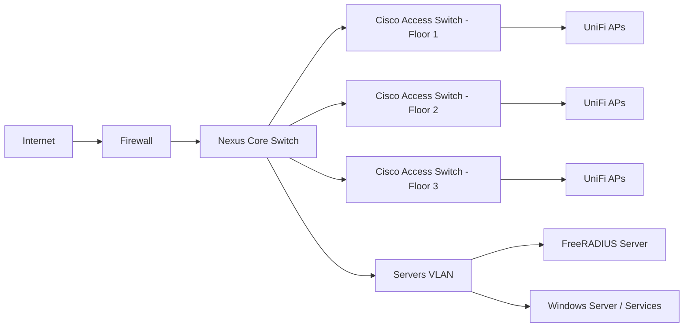
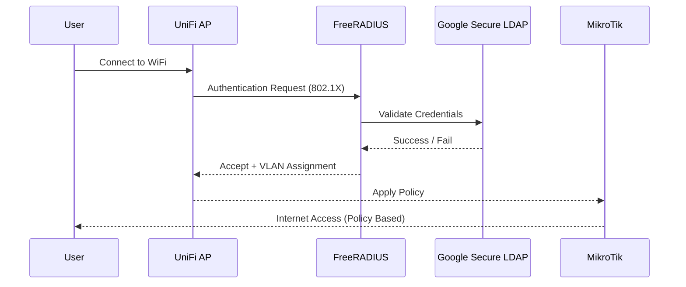

#                                                   👋 Hi, I'm Zohaib Hassan

  

  
  
  
  

---

## 🚀 About Me

* 🎓 Working in **University IT Infrastructure**
* 🌐 Designing **Enterprise Campus Networks (Core + Access)**
* 🔐 Implementing **802.1X, RADIUS, Identity-Based Access**
* ☁️ Exploring **Azure, AWS & Hybrid Identity**
* ⚙️ Focused on **Scalable & Secure Architectures**

---

## 🧠 Skills & Expertise

### 🌐 Networking

* Cisco (Core, Access, VLAN Design)
* MikroTik (Routing, Firewall, QoS, Load Balancing)
* UniFi Wireless Deployment
* Inter-VLAN Routing, STP

### 🔐 Security

* 802.1X (WPA2-Enterprise)
* FreeRADIUS + Google Secure LDAP
* Network Segmentation
* Firewall Design (pfSense, Fortinet alternatives)

### ☁️ Cloud & Identity

* Azure AD (Entra ID)
* Google Workspace (SSO, Secure LDAP)
* AWS (Free Tier, IAM)
* Hybrid Identity Architecture

### 💻 Systems

* Windows Server (AD, DNS, DHCP, WDS)
* Ubuntu Server / Linux Networking
* Git, Automation Basics

---

## 🧩 Architecture Diagrams

### 🏫 Campus Network Architecture

---

### 🔐 Identity-Based Access Flow (802.1X + Google LDAP)

---

## 📂 Featured Projects

### 🏫 University Campus Network

* Multi-floor VLAN-based architecture
* Cisco Core + Access + UniFi WiFi
* High availability & segmentation

---

### 🔐 Identity-Based Internet System

* FreeRADIUS + Google Secure LDAP
* Dynamic VLAN assignment
* Role-based bandwidth control (Students / Faculty / Admin / VIP)

---

### ☁️ Hybrid Identity Design

* Azure AD + Google Workspace integration
* SSO architecture planning
* Scalable user authentication

---

### 📡 VoIP Deployment (FreePBX)

* Department-wise extensions
* SIP trunk integration
* Internal communication system

---

## 📊 GitHub Stats

  
  

---

## ⚡ Current Focus

* 🔐 Zero Trust Network Architecture
* ☁️ Azure Identity & Access Management
* 📊 Centralized Logging (SIEM concepts)
* 🧠 Advanced Network Security

---

## 📫 Connect With Me

* 💼 LinkedIn: (Add link)
* 📧 Email: (Add email)

---

  ⭐ Building secure, scalable, and intelligent networks.

